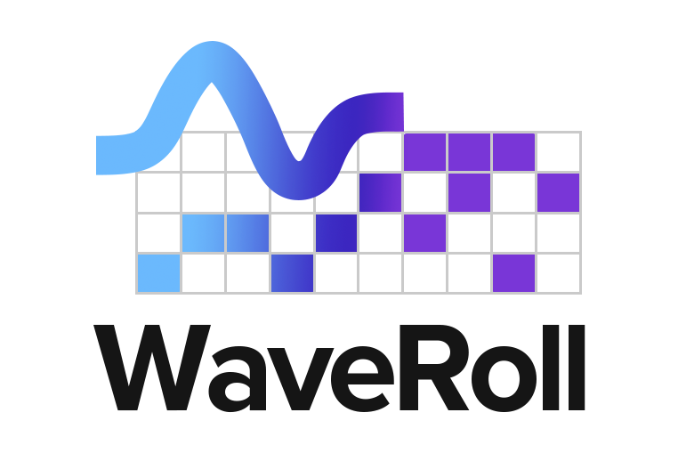

# WaveRoll

<div style="text-align: center;">
  
</div>

> **WaveRoll** is an interactive [JavaScript library](https://www.npmjs.com/package/wave-roll) that enables comparative visualization and synchronized playback of multiple MIDI piano rolls on a browser. 


- You can try the web demo at [https://crescent-stdio.github.io/wave-roll/](https://crescent-stdio.github.io/wave-roll/).
- NPM package: [https://www.npmjs.com/package/wave-roll](https://www.npmjs.com/package/wave-roll)


## Installation

### [NPM: wave-roll](https://www.npmjs.com/package/wave-roll)

```bash
npm install wave-roll
```

### Usage (NPM)

```html
<!DOCTYPE html>
<html>
<head>
  <script type="module">
    import 'wave-roll';
  </script>
</head>
<body>
  <wave-roll
    style="width: 100%;"
    files='[
      {"path": "./audio/track.wav", "name": "Track Audio", "type": "audio"},
      {"path": "./midi/ground_truth.mid", "name": "Ground Truth", "type": "midi"},
      {"path": "./midi/modelA.mid", "name": "Model A", "type": "midi"}
    ]'>
  </wave-roll>
</body>
</html>
```

### Using CDN (ES Module)
You can try the ES Module demo [here](https://crescent-stdio.github.io/wave-roll/examples/es-module/) and [sample codes](https://github.com/crescent-stdio/wave-roll/blob/main/docs/examples/es-module/index.html).


```html
<!DOCTYPE html>
<html>
<head>
  <script type="module">
    import 'https://cdn.jsdelivr.net/npm/wave-roll@latest/dist/wave-roll.es.js';
  </script>
</head>
<body>
  <wave-roll
    style="width: 100%;"
    files='[
      {"path": "./audio/track.wav", "name": "Track Audio", "type": "audio"},
      {"path": "./midi/ground_truth.mid", "name": "Ground Truth", "type": "midi"},
      {"path": "./midi/modelA.mid", "name": "Model A", "type": "midi"}
    ]'>
  </wave-roll>
</body>
</html>
```

### Using UMD CDN (Traditional Script)
You can try the UMD demo [here](https://crescent-stdio.github.io/wave-roll/examples/umd/) and [sample codes](https://github.com/crescent-stdio/wave-roll/blob/main/docs/examples/umd/index.html).

```html
<!DOCTYPE html>
<html>
<head>
  <script src="https://cdn.jsdelivr.net/npm/wave-roll@latest/dist/wave-roll.umd.js"></script>
</head>
<body>
  <wave-roll
    style="width: 100%;"
    files='[
      {"path": "./audio/track.wav", "name": "Track Audio", "type": "audio"},
      {"path": "./midi/ground_truth.mid", "name": "Ground Truth", "type": "midi"},
      {"path": "./midi/modelA.mid", "name": "Model A", "type": "midi"}
    ]'>
  </wave-roll>
</body>
</html>
```

### GitHub Pages Usage

For GitHub Pages deployment, you can use the CDN directly:

```html
<!DOCTYPE html>
<html>
<head>
  <meta charset="UTF-8">
  <meta name="viewport" content="width=device-width, initial-scale=1.0">
  <title>WaveRoll Demo</title>
  <script type="module">
    import 'https://cdn.jsdelivr.net/npm/wave-roll@latest/dist/wave-roll.es.js';
  </script>
</head>
<body>
  <wave-roll
    style="width: 100%"
    files='[
      {"path": "./audio/track.wav", "name": "Track Audio", "type": "audio"},
      {"path": "./midi/ground_truth.mid", "name": "Ground Truth", "type": "midi"},
      {"path": "./midi/modelA.mid", "name": "Model A", "type": "midi"}
    ]'>
  </wave-roll>
</body>
</html>
```

### In React

```jsx
import 'wave-roll';

function MidiComparison() {
  const files = [
    { path: "./audio/track.wav", name: "Track Audio", type: "audio" },
    { path: "./midi/ground_truth.mid", name: "Ground Truth", type: "midi" },
    { path: "./midi/modelA.mid", name: "Model A", type: "midi" }
  ];

  return (
    <wave-roll 
      style={{ width: '100%' }}
      files={JSON.stringify(files)}
    />
  );
}
```

### Standalone Demo

Try the standalone version with drag-and-drop file upload interface:

- **Live Demo**: [https://crescent-stdio.github.io/wave-roll/standalone.html](https://crescent-stdio.github.io/wave-roll/standalone.html)
- **Source Code**: [docs/examples/standalone.html](https://github.com/crescent-stdio/wave-roll/blob/main/docs/examples/standalone.html)

The standalone demo is a minimal, ready-to-use interface where users can directly upload and compare MIDI/audio files without any additional setup.

### Using in Jupyter Notebook

You can embed WaveRoll in Jupyter notebooks using `IFrame`:

```python
from IPython.display import IFrame
IFrame(src='https://crescent-stdio.github.io/wave-roll/standalone.html', width='100%', height='800px')
```

- **Example Notebook**: [docs/examples/jupyter-notebook/wave-roll-demo.ipynb](https://github.com/crescent-stdio/wave-roll/blob/main/docs/examples/jupyter-notebook/wave-roll-demo.ipynb)
- **Open in Google Colab**: [](https://colab.research.google.com/github/crescent-stdio/wave-roll/blob/main/docs/examples/jupyter-notebook/wave-roll-demo.ipynb)

This is particularly useful for music information retrieval (MIR) research, allowing you to visualize and compare transcription results directly in your analysis notebooks.

### VS Code Extension

Use WaveRoll directly in VS Code with the **Wave Roll Solo** extension:

- Open any `.mid` or `.midi` file to view it as an interactive piano roll
- Play MIDI files with built-in Tone.js synthesis
- Adjust tempo and export MIDI with modified tempo

**Installation**: Search "WaveRoll Solo" in VS Code Extensions marketplace

**GitHub**: [crescent-stdio/wave-roll-solo](https://github.com/crescent-stdio/wave-roll-solo)

## API

### Attributes

| Attribute | Type | Description |
|-----------|------|-------------|
| `files` | `string` | JSON string array of file objects with `path` and `name` properties |
| `style` | `string` | CSS styles for the component container |
| `readonly` | `boolean attribute` | When present, hides UI controls for adding/removing files (read‑only mode) |

#### Read‑only Mode

Add the `readonly` attribute to disable file addition and deletion in the Settings modal (the "Add MIDI Files" button and per‑file delete buttons are hidden):

```html
<wave-roll
  style="width: 100%; height: 600px;"
  files='[
    {"path": "./audio/track.wav", "name": "Track Audio", "type": "audio"},
    {"path": "./midi/ground_truth.mid", "name": "Ground Truth", "type": "midi"},
    {"path": "./midi/modelA.mid", "name": "Model A", "type": "midi"}
  ]'
  readonly
></wave-roll>
```

You can toggle this at runtime too:

```js
const el = document.querySelector('wave-roll');
el.setAttribute('readonly', '');      // enable read-only
el.removeAttribute('readonly');       // disable read-only
```

### File Object Structure

```typescript
interface FileItem {
  path: string;   // URL or relative path to the file
  name: string;   // Display name shown in UI
  type?: "midi" | "audio"; // Defaults to "midi" when omitted
  color?: string; // Custom color for track visualization (hex or CSS color)
}
```

### JavaScript API

Control the player programmatically:

```javascript
const waveRoll = document.querySelector('wave-roll');

// Playback controls
await waveRoll.play();
waveRoll.pause();
waveRoll.seek(30);  // Seek to 30 seconds

// State
console.log(waveRoll.isPlaying);  // boolean
console.log(waveRoll.getState()); // { currentTime, duration, tempo, ... }
```

### Tempo Control

WaveRoll includes an interactive tempo control with popover input:

- Click the BPM badge in the player controls to adjust tempo
- Supports range from 10 to 200 BPM
- Audio playback automatically adjusts with pitch preservation

### MIDI Export

Export MIDI files with modified tempo via the Settings panel:

1. Adjust tempo using the tempo control
2. Open Settings (gear icon)
3. Click "Export with Current Tempo"

The exported file preserves all note data with updated tempo metadata.

**Programmatic usage:**

```javascript
import { exportMidiWithTempo } from 'wave-roll';

// Export MIDI with new tempo (triggers download)
await exportMidiWithTempo(midiFile, 144);

// Export as Blob for custom handling
import { exportMidiWithTempoAsBlob } from 'wave-roll';
const blob = await exportMidiWithTempoAsBlob(midiFile, 144);
```

## Development

```bash
# Install dependencies
npm install

# Run development server
npm run dev

# Build for production
npm run build

# Run tests
npm test
```

## Acknowledgments
This library includes functionality ported from [mir_eval](https://github.com/mir-evaluation/mir_eval), Music Information Retrieval evaluation library.

## License

MIT License - see [LICENSE](LICENSE) file for details

## Citation

If you use WaveRoll in your research, please cite:

```bibtex
@inproceedings{waveroll2025,
  title={WaveRoll: JavaScript Library for Comparative MIDI Piano-Roll Visualization},
  author={Park, Hannah and Jeong, Dasaem},
  booktitle={Proceedings of 26th International Society for Music Information Retrieval Conference (ISMIR)},
  year={2025}
}
```