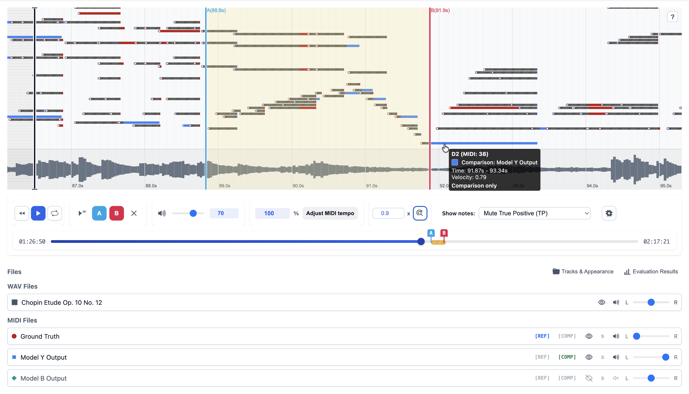

# WaveRoll

<div style="text-align: center;">
  
</div>

> **WaveRoll** is an interactive [JavaScript library](https://www.npmjs.com/package/wave-roll) that enables comparative visualization and synchronized playback of multiple MIDI piano rolls on a browser. 




- You can try the web demo at [crescent-stdio.github.io/wave-roll](https://crescent-stdio.github.io/wave-roll/).
- NPM package: [npmjs.com/package/wave-roll](https://www.npmjs.com/package/wave-roll)


## Installation

### [NPM: wave-roll](https://www.npmjs.com/package/wave-roll)

```bash
npm install wave-roll
```

### Usage

```html
<!DOCTYPE html>
<html>
<head>
  <script type="module">
    import 'wave-roll';
  </script>
</head>
<body>
  <wave-roll
    style="width: 100%; height: 600px;"
    files='[
      {"path": "path/to/baseline.mid", "name": "Baseline"},
      {"path": "path/to/model1.mid", "name": "Model 1"},
      {"path": "path/to/model2.mid", "name": "Model 2"}
    ]'>
  </wave-roll>
</body>
</html>
```

### Using CDN (ES Module)
You can try the ES Module demo [here](https://crescent-stdio.github.io/wave-roll/test-esm-cdn.html).

```html
<!DOCTYPE html>
<html>
<head>
  <script type="module">
    import 'https://cdn.jsdelivr.net/npm/wave-roll@latest/dist/wave-roll.es.js';
  </script>
</head>
<body>
  <wave-roll
    style="width: 100%; height: 600px;"
    files='[
      {"path": "https://example.com/baseline.mid", "name": "Baseline"},
      {"path": "https://example.com/model1.mid", "name": "Model 1"},
      {"path": "https://example.com/model2.mid", "name": "Model 2"}
    ]'>
  </wave-roll>
</body>
</html>
```

### Using UMD CDN (Traditional Script)
You can try the UMD demo [here](https://crescent-stdio.github.io/wave-roll/test-umd.html).

```html
<!DOCTYPE html>
<html>
<head>
  <script src="https://cdn.jsdelivr.net/npm/wave-roll@latest/dist/wave-roll.umd.js"></script>
</head>
<body>
  <wave-roll
    style="width: 100%; height: 600px;"
    files='[
      {"path": "https://example.com/baseline.mid", "name": "Baseline"},
      {"path": "https://example.com/model1.mid", "name": "Model 1"},
      {"path": "https://example.com/model2.mid", "name": "Model 2"}
    ]'>
  </wave-roll>
</body>
</html>
```

### GitHub Pages Usage

For GitHub Pages deployment, you can use the CDN directly:

```html
<!DOCTYPE html>
<html>
<head>
  <meta charset="UTF-8">
  <meta name="viewport" content="width=device-width, initial-scale=1.0">
  <title>WaveRoll Demo</title>
  <script type="module">
    import 'https://cdn.jsdelivr.net/npm/wave-roll@latest/dist/wave-roll.es.js';
  </script>
</head>
<body>
  <wave-roll
    style="width: 100%; height: 600px;"
    files='[
      {"path": "./midi/example1.mid", "name": "Example 1"},
      {"path": "./midi/example2.mid", "name": "Example 2"}
    ]'>
  </wave-roll>
</body>
</html>
```

### In React

```jsx
import 'wave-roll';

function MidiComparison() {
  const files = [
    { path: "/midi/baseline.mid", name: "Baseline" },
    { path: "/midi/model1.mid", name: "Model 1" },
    { path: "/midi/model2.mid", name: "Model 2" }
  ];

  return (
    <wave-roll 
      style={{ width: '100%', height: '600px' }}
      files={JSON.stringify(files)}
    />
  );
}
```

## API

### Attributes

| Attribute | Type | Description |
|-----------|------|-------------|
| `files` | `string` | JSON string array of file objects with `path` and `name` properties |
| `style` | `string` | CSS styles for the component container |

### File Object Structure

```typescript
interface MidiFile {
  path: string;  // URL or path to the MIDI file
  name: string;  // Display name for the file
}
```

## Advanced Features

### A-B Loop Playback
Click the A button to set the start point and B button to set the end point. The selected region will loop continuously during playback.

### Per-File Controls
- **Visible**: Show/hide individual MIDI files
- **Sustain**: Play only the selected file
- **Mute/Unmute**: Silence individual MIDI files while keeping them visible
- **Pan**: Adjust stereo positioning (-100 to +100)

### Tempo Control
Adjust playback speed from 50% to 200% without affecting pitch.

### Visual Settings
- **Note Height**: Adjust the height of notes in the piano roll
- **Highlight Mode**: Various options for emphasizing specific files
- **Sustain Pedal**: Show/hide sustain pedal (CC64) visualization


## Development

```bash
# Install dependencies
npm install

# Run development server
npm run dev

# Build for production
npm run build

# Run tests
npm test
```

## Acknowledgments

This library includes functionality ported from:
- [mir_eval](https://github.com/mir-evaluation/mir_eval) - Music Information Retrieval evaluation library

## License

MIT License - see [LICENSE](LICENSE) file for details

## Citation

If you use WaveRoll in your research, please cite:

```bibtex

```